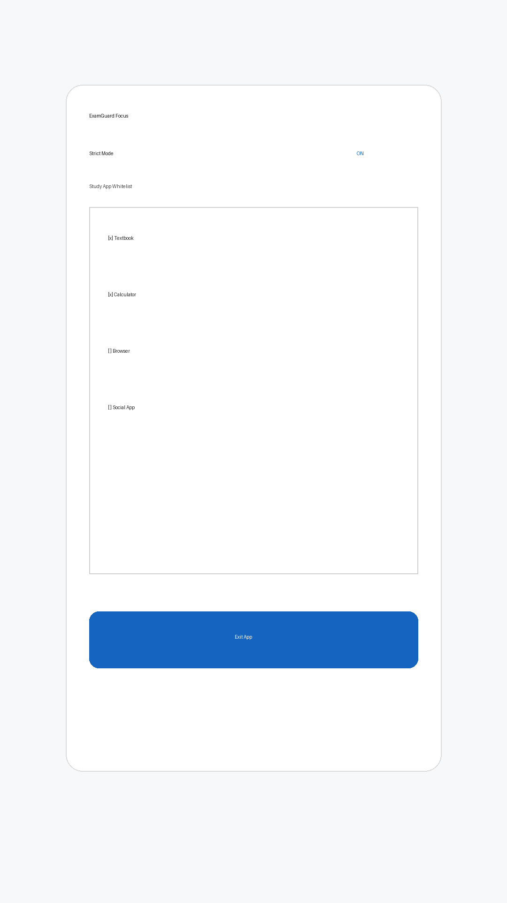

# ExamGuard

ExamGuard Focus is a Kotlin + Jetpack Compose Android app skeleton for strict exam preparation mode.

## Included capabilities
- Study app whitelist picker (PackageManager + RecyclerView embedded in Compose)
- Notification listener that cancels non-whitelisted notifications
- Accessibility strict mode app blocker for non-whitelisted foreground apps
- Emergency contact list + call filtering manager backed by `TelephonyManager`
- Usage tracking with `UsageStatsManager`
- Room entities/DAO for daily usage storage
- Weekly PDF report generator using `PdfDocument`
- Dashboard with **Exit App** option

## UI preview


## Build locally
```bash
./gradlew assembleDebug
```

## CI APK build
A GitHub Actions workflow at `.github/workflows/android-apk.yml` builds and uploads a debug APK artifact from `main`.
